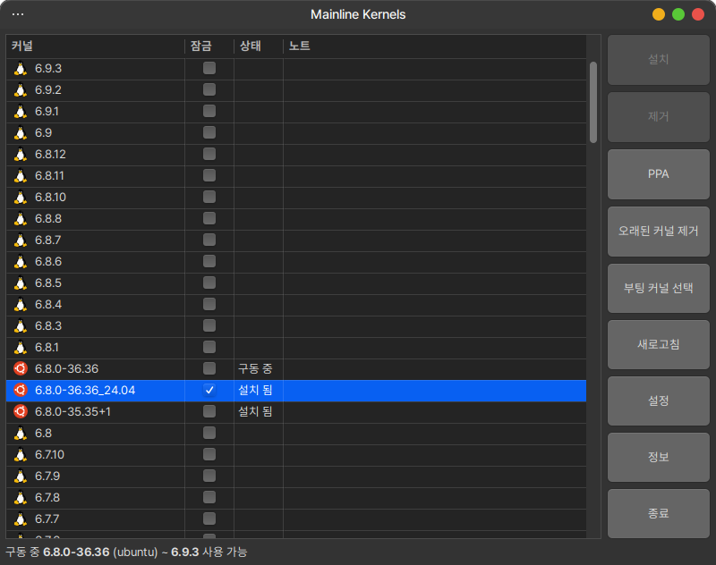
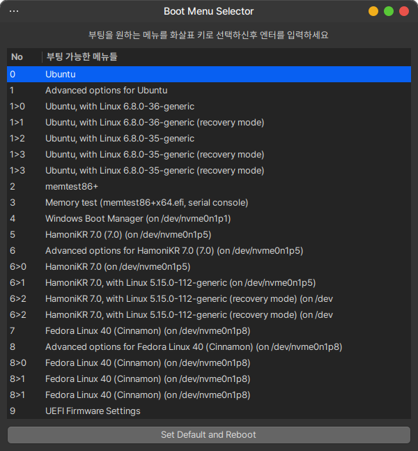

## 커널 업그레이드 도구 mainline

이 프로그램은 특정 버전 또는 최신 버전의 우분투 커널을 사용하고 싶은 사용자가
터미널을 사용하지 않고, GUI 를 통한 손쉬운 커널 업그레이드를 할 수 있도록 해주는 프로그램 입니다.

별도의 터미널 명령을 몰라도, 누구나 쉽게 자신의 시스템 커널을 업그레이드 하거나 삭제할 수 있습니다.

주의) 커널을 업그레이드 하면 시스템의 하드웨어가 정상적으로 동작하지 않을 수 있으니, 이전 커널로 복구하는 방법을 확인 후 새 커널을 설치하시기 바랍니다.

 * Upstream : https://github.com/bkw777/mainline
 * latest version : 1.4.10

### 스크린샷


### 부팅 시 사용될 커널을 설정할 수 있는 기능 제공



## 프로그램 설치

### Ubuntu, Debian, LinuxMint

터미널을 열고(Ctrl+Alt+T) 아래 명령어를 입력하세요.
```
# 하모니카 APT 저장소 추가
wget -qO- https://pkg.hamonikr.org/add-hamonikr.apt | sudo -E bash -

# 프로그램 설치
sudo apt install mainline
```

